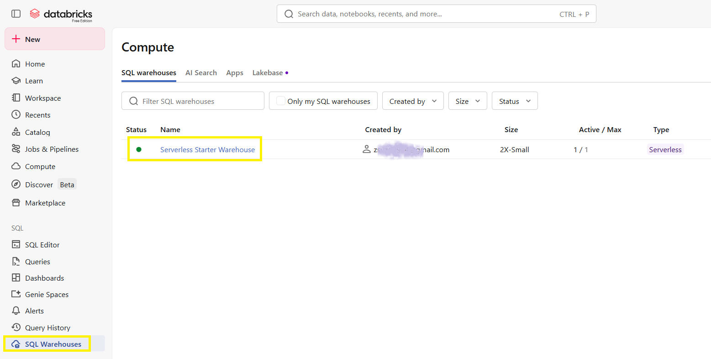
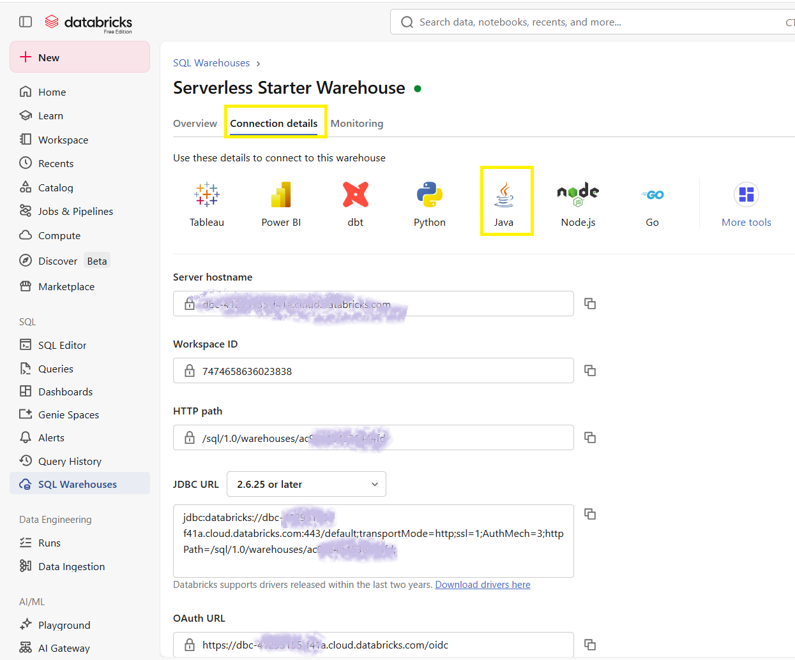
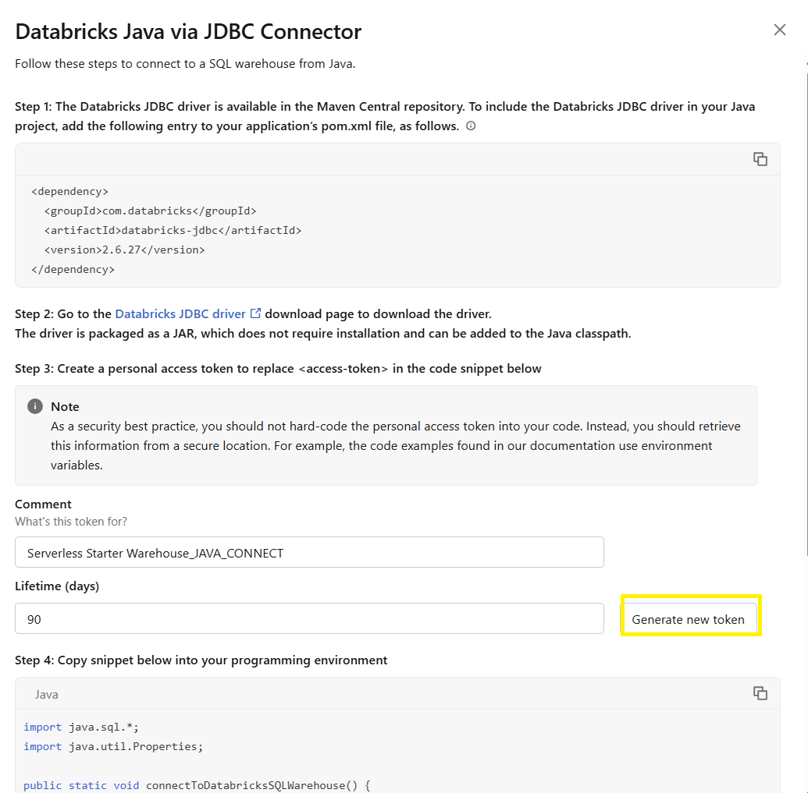
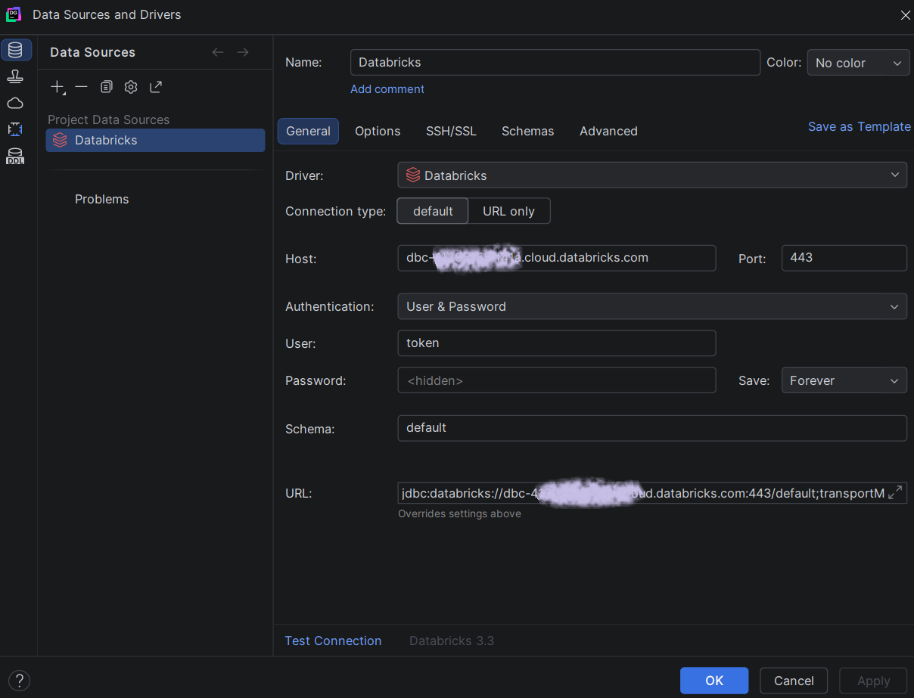
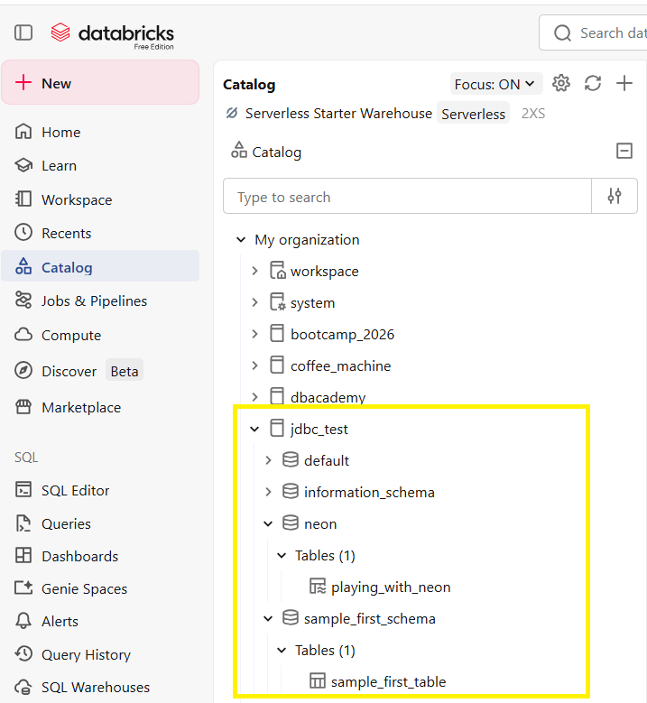
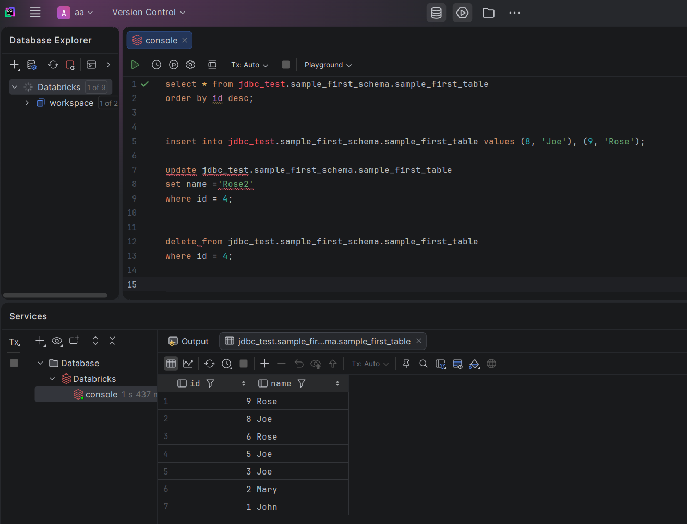

# Databricks → DataGrip kapcsolat lépésről lépésre

## 1. SQL Warehouse kiválasztása

Nyisd meg a **SQL Warehouses** menüpontot és válaszd ki a használni kívánt warehouse-t.



A példában a warehouse neve:

```text
Serverless Starter Warehouse
```

---

## 2. Connection Details megnyitása

A warehouse adatlapján válaszd a **Connection details** fület, majd a kapcsolati típusok közül a **Java** opciót.



Innen szükséges kimásolni:

- Server hostname
- HTTP Path
- JDBC URL

---

## 3. Personal Access Token létrehozása

A Java kapcsolat beállításainál kattints a **Generate new token** gombra.



A generált tokent mentsd el, mert később a DataGrip kapcsolat jelszavaként fog szolgálni.

---

## 4. DataGrip Databricks kapcsolat létrehozása

Nyisd meg a **Data Sources and Drivers** ablakot és hozz létre egy új **Databricks** kapcsolatot.



### Beállítások

| Mező | Érték |
|--------|--------|
| Driver | Databricks |
| Host | Databricks Server hostname |
| Port | 443 |
| Authentication | User & Password |
| User | token |
| Password | Personal Access Token |
| Schema | default vagy a kívánt schema |

A JDBC URL mezőbe a Databricks által generált JDBC URL kerül.

---

## 5. Catalog és sémák elérése

Sikeres kapcsolat után a Databricks katalógusok és táblák megjelennek.



Példa struktúra:

```text
jdbc_test
└── sample_first_schema
   └── sample_first_table

```

---

## 6. SQL műveletek DataGrip-ből

A kapcsolat létrejötte után közvetlenül futtathatók SQL parancsok.



### SELECT

```sql
select *
from jdbc_test.sample_first_schema.sample_first_table
order by id desc;
```

### INSERT

```sql
insert into jdbc_test.sample_first_schema.sample_first_table
values (8, 'Joe'),
       (9, 'Rose');
```

### UPDATE

```sql
update jdbc_test.sample_first_schema.sample_first_table
set name = 'Rose2'
where id = 4;
```

### DELETE

```sql
delete from jdbc_test.sample_first_schema.sample_first_table
where id = 4;
```

---

## Összefoglalás

A DataGrip ↔ Databricks kapcsolat létrehozásához szükséges:

1. SQL Warehouse
2. JDBC kapcsolat adatai
3. Personal Access Token
4. Databricks Data Source a DataGrip-ben

A beállítás után a Databricks táblák ugyanúgy kezelhetők, mint bármely más JDBC adatforrás.
