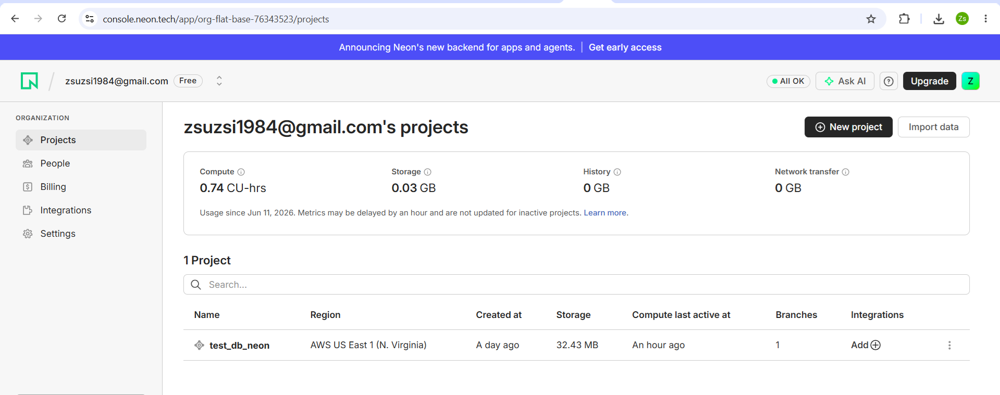
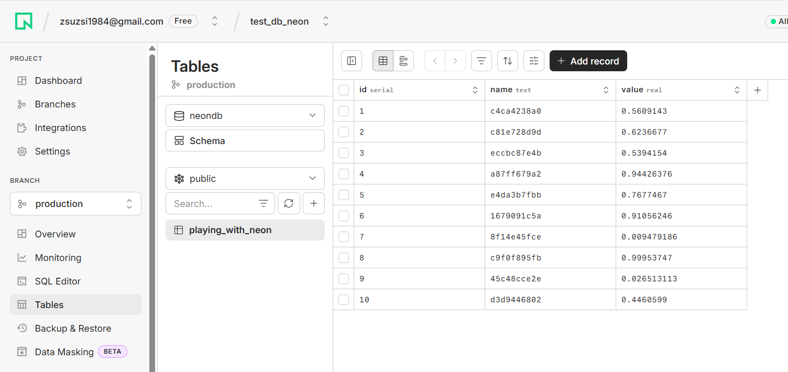

# PostgreSQL adatbázis létrehozása Neon-ban

Ebben a leírásban bemutatom, hogyan hoztam létre egy PostgreSQL adatbázist a Neon felületén.

## 1. Belépés a Neon konzolba

Megnyitottam a Neon webes felületét:

```text
https://console.neon.tech
```

Bejelentkezés után a projektek oldalára kerültem.



## 2. Új projekt létrehozása

A Neon konzolban létrehoztam egy új projektet.

A projekt neve:

```text
test_db_neon
```

A projekt régiója:

```text
AWS US East 1 (N. Virginia)
```

A létrehozás után a projekt megjelent a projektek listájában.

## 3. Branch és adatbázis ellenőrzése

A projektben az alapértelmezett branch:

```text
production
```

Az adatbázis neve:

```text
neondb
```

A séma:

```text
public
```

## 4. Tábla létrehozása

A `public` sémában létrehoztam egy táblát:

```text
playing_with_neon
```

A tábla oszlopai:

| Oszlop neve | Típus |
|---|---|
| id | serial |
| name | text |
| value | real |

## 5. Adatok beszúrása a táblába

A táblába tesztadatokat szúrtam be.
A táblában 10 rekord látható.



Példa rekord:

| id | name | value |
|---|---|---|
| 1 | c4ca4238a0 | 0.5609143 |

## Összegzés

A Neon-ban sikeresen létrehoztam egy PostgreSQL adatbázist, azon belül egy `playing_with_neon` nevű táblát, majd tesztadatokat töltöttem bele.
