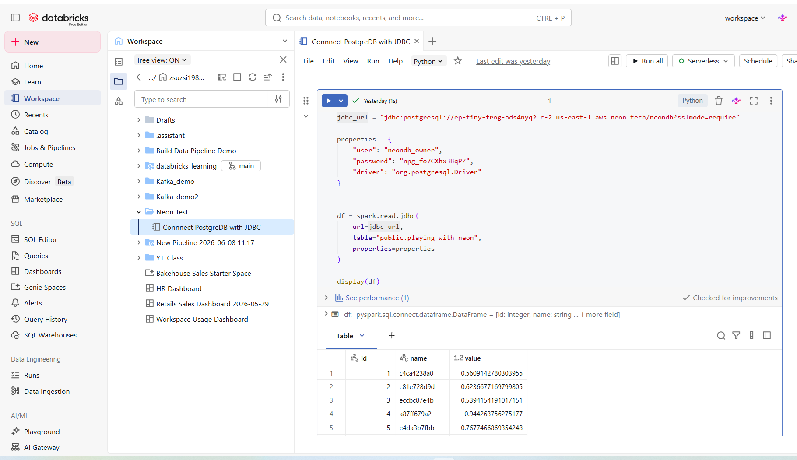

# PostgreSQL adatok lekérdezése Neon adatbázisból Databricks segítségével

Ebben a leírásban bemutatom, hogyan kapcsolódtam egy Neon PostgreSQL adatbázishoz Databricks környezetből JDBC kapcsolaton keresztül, majd hogyan olvastam be egy tábla adatait Python használatával.

## Előfeltételek

A feladat végrehajtásához rendelkezésre állt:

- Egy működő Neon PostgreSQL adatbázis
- Egy Databricks Workspace
- Hálózati kapcsolat a Neon adatbázishoz
- PostgreSQL JDBC driver támogatás

## 1. Notebook létrehozása Databricks-ben

A Databricks Workspace-ben létrehoztam egy Python notebookot:

```text
Connect PostgreDB with JDBC
```

A notebook célja a Neon PostgreSQL adatbázis elérése és az adatok lekérdezése volt.

## 2. JDBC kapcsolat konfigurálása

A Neon adatbázis JDBC kapcsolati URL-jét adtam meg:

```python
jdbc_url = "jdbc:postgresql://<host>/<database>?sslmode=require"
```

Az SSL kapcsolat használata kötelező a Neon szolgáltatás esetében.

## 3. Kapcsolati paraméterek beállítása

A kapcsolódáshoz szükséges felhasználónevet, jelszót és JDBC drivert egy Python szótárban definiáltam:

```python
properties = {
    "user": "<username>",
    "password": "<password>",
    "driver": "org.postgresql.Driver"
}
```

## 4. Adatok beolvasása Spark DataFrame-be

A PostgreSQL tábla adatait a Spark JDBC connector segítségével olvastam be.

```python
df = spark.read.jdbc(
    url=jdbc_url,
    table="public.playing_with_neon",
    properties=properties
)
```

A lekérdezett tábla:

```text
public.playing_with_neon
```

## 5. Az eredmény megjelenítése

Az adatok megjelenítéséhez a Databricks beépített `display()` függvényét használtam.

```python
display(df)
```

Ez automatikusan táblázatos formában jelenítette meg a PostgreSQL rekordokat.

## Eredmény

A Databricks sikeresen csatlakozott a Neon PostgreSQL adatbázishoz, és betöltötte a `playing_with_neon` tábla adatait.

A megjelenített oszlopok:

| Oszlop | Típus |
|---------|---------|
| id | integer |
| name | string |
| value | double |

## Képernyőkép

Az alábbi képen látható a sikeres JDBC kapcsolat és a lekérdezett adatok megjelenítése Databricks környezetben.



## Teljes példa kód

```python
jdbc_url = "jdbc:postgresql://<host>/<database>?sslmode=require"

properties = {
    "user": "<username>",
    "password": "<password>",
    "driver": "org.postgresql.Driver"
}

df = spark.read.jdbc(
    url=jdbc_url,
    table="public.playing_with_neon",
    properties=properties
)

display(df)
```

## Összegzés

Ebben a példában Databricks környezetből JDBC kapcsolaton keresztül csatlakoztam egy Neon PostgreSQL adatbázishoz. A Spark JDBC API segítségével beolvastam a `playing_with_neon` tábla adatait egy DataFrame-be, majd az eredményt megjelenítettem a Databricks notebook felületén.
