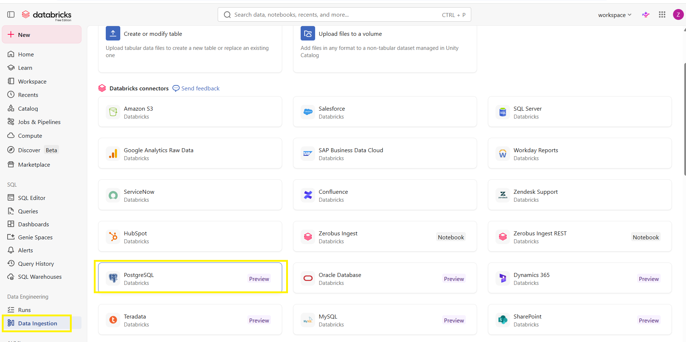
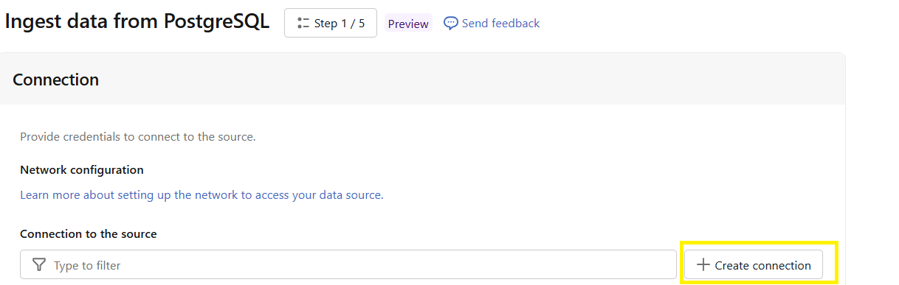
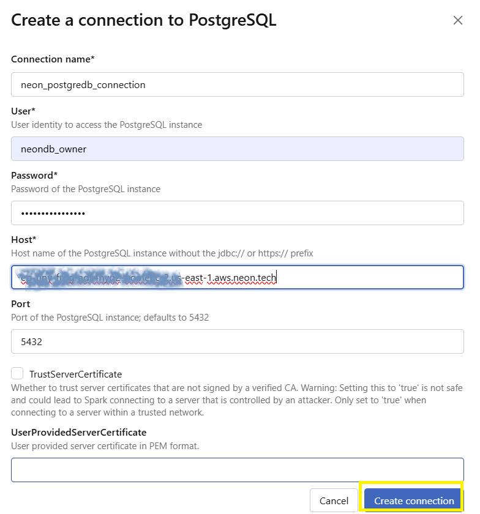
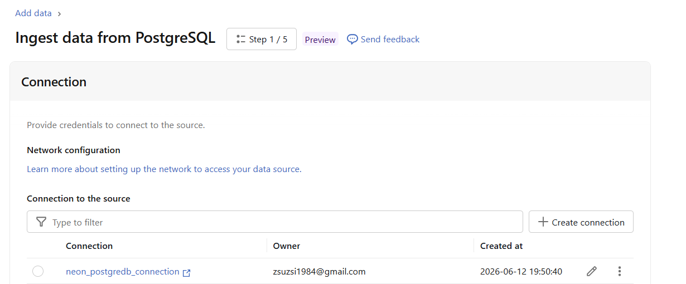
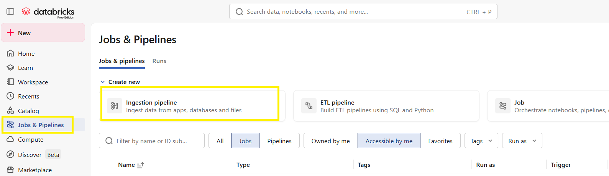
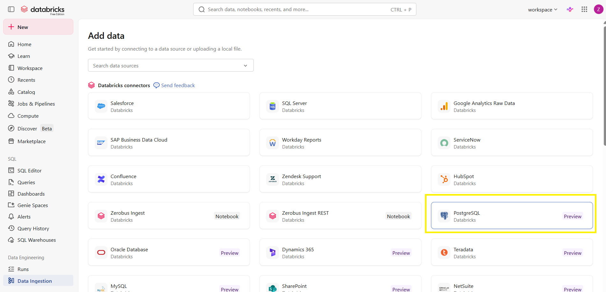
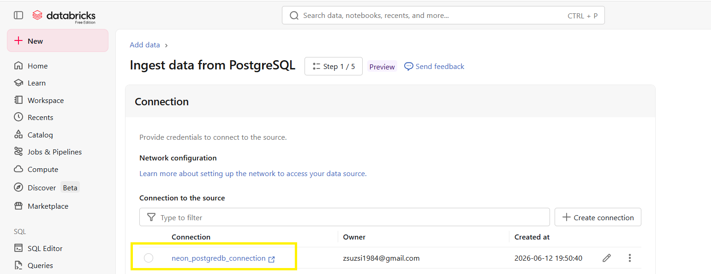

# Data Ingestion létrehozása Databricks-ben PostgreSQL adatforráshoz

Ebben a leírásban bemutatom, hogyan hoztam létre PostgreSQL adatforráshoz Data Ingestion folyamatot Databricks-ben.

A példában egy Neon PostgreSQL adatbázishoz kapcsolódtam Databricks-ből.

## Előfeltételek

A lépésekhez szükséges:

- működő Databricks Workspace
- PostgreSQL adatbázis, például Neon PostgreSQL
- adatbázis host neve
- felhasználónév
- jelszó
- PostgreSQL port, alapértelmezetten `5432`

## 1. Data Ingestion menüpont megnyitása

A Databricks bal oldali menüjében kiválasztottam a **Data Ingestion** menüpontot.

Ezután az elérhető Databricks connectorok között megkerestem a **PostgreSQL** connectort.




## 2. PostgreSQL adatforrás kapcsolat létrehozása

A PostgreSQL connector kiválasztása után megnyílt az **Ingest data from PostgreSQL** oldal.

Itt az első lépés a kapcsolat létrehozása volt.

A **Create connection** gombra kattintottam.



## 3. Kapcsolati adatok megadása

A megjelenő ablakban kitöltöttem a PostgreSQL kapcsolat adatait.

A kapcsolat neve:

```text
neon_postgredb_connection
```

A felhasználó:

```text
neondb_owner
```

A host mezőbe a Neon PostgreSQL adatbázis host nevét adtam meg.

A port:

```text
5432
```

Ez a PostgreSQL alapértelmezett portja.




## 4. Kapcsolat létrehozása

Az adatok megadása után a **Create connection** gombra kattintottam.

Ezzel létrejött a PostgreSQL kapcsolat Databricks-ben.


## 5. Létrehozott connection ellenőrzése

A kapcsolat létrehozása után visszakerültem az **Ingest data from PostgreSQL** oldalra.

A létrehozott connection megjelent a listában:

```text
neon_postgredb_connection
```

A connection tulajdonosa:

```text
zsuzsi1984@gmail.com
```



## 6. Ingestion pipeline indítása

A Databricks bal oldali menüjében kiválasztottam a **Jobs & Pipelines** menüpontot.

Itt a **Create new** résznél kiválasztottam az **Ingestion pipeline** lehetőséget.



Az Ingestion pipeline segítségével adatokat lehet beolvasni külső adatforrásokból, például adatbázisokból, fájlokból vagy alkalmazásokból.

## 7. PostgreSQL kapcsolat kiválasztása ingestion-höz

Az ingestion folyamatban a korábban létrehozott PostgreSQL connection kiválasztható volt:

```text
neon_postgredb_connection
```

## 8. PostgreSQL connector kiválasztása

Az **Add data** oldalon kiválasztottam a **PostgreSQL** connectort.






Ezzel a Databricks már tudja, hogy melyik PostgreSQL adatforrásból kell adatokat beolvasnia.

## 9. Kiválasztása, hogy melyik táblát töltsük át Neon űPostgreDB-ből Databricks melyik sémájába

## 10. Összegzés

Ebben a folyamatban létrehoztam egy PostgreSQL adatforrás kapcsolatot Databricks-ben, majd előkészítettem az adatbetöltést Data Ingestion pipeline használatával.

A fő lépések:

1. Data Ingestion menüpont megnyitása
2. PostgreSQL connector kiválasztása
3. Új connection létrehozása
4. PostgreSQL kapcsolat adatainak megadása
5. Connection mentése
6. Ingestion pipeline létrehozása
7. PostgreSQL connection kiválasztása az ingestion folyamathoz


